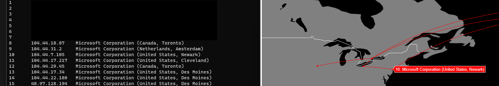

# tracert-v
Visualized traceroute using Python. This python script is intended to be run from the terminal. It uses [icmplib](https://github.com/ValentinBELYN/icmplib) for performing the traceroute. It then queries [ip-api](https://ip-api.com) to reslove the found ip-addresses to geo-locations and further displays the route on a world map using [plotly](https://github.com/plotly/plotly.py).

Before running make sure all needed modules are installed: `pip install icmplib plotly aiohttp asyncio`

## How to use

`python3 tracert-v {domain or IPv4 address}` for looking up one specific route

`python3 tracert-v all` for getting a live view of all open connections (NOT IMPLEMENTED YET)

## Possible Issues

* The "traceroute" function from icmplib needs **root privileges**, make sure to run the script with them. (On Linux use `sudo -E python3 tracert-v` and on Windows run "cmd" as administrator.)

* If you only see the last hop of traceroutes, this might have to do with your firewall settings (see [icmplib issue](https://github.com/ValentinBELYN/icmplib/issues/10)).  To fix this add/edit the rule in your firewall to **allow incoming ICMPv4/ICMPv6 "timeout" and "destination unreachable" packets**.
